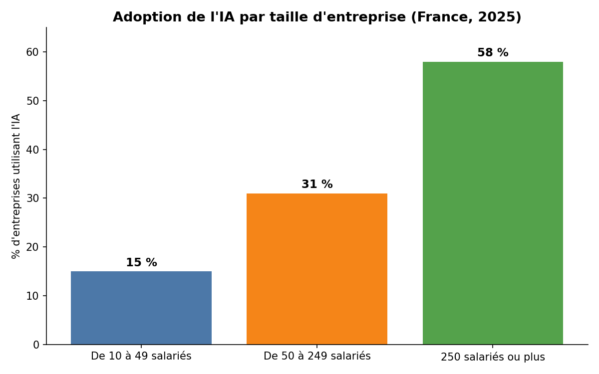
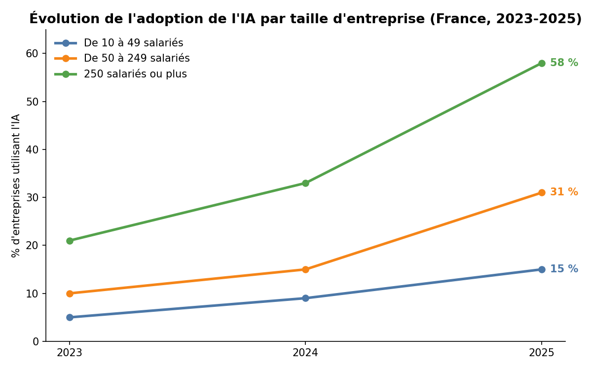

# L'IA en entreprise, mais pas pour tout le monde

Je voulais vérifier un truc : est-ce que les PME rattrapent leur retard sur l'IA, ou est-ce que ça s'aggrave. Les chiffres officiels de l'Insee répondent clairement, et pas dans le sens où je m'y attendais.



En 2025, 58 % des entreprises de 250 salariés et plus utilisent une techno d'IA, contre 15 % pour les 10-49 salariés. L'écart n'est pas nouveau, mais ce qui frappe c'est sa trajectoire :

| | 2023 | 2024 | 2025 |
|---|---|---|---|
| 10 à 49 salariés | 5 % | 9 % | 15 % |
| 50 à 249 salariés | 10 % | 15 % | 31 % |
| 250 salariés ou plus | 21 % | 33 % | 58 % |
| **Écart (250+ vs 10-49)** | 16 pts | 24 pts | **43 pts** |

L'écart a presque triplé en deux ans. Tout le monde adopte l'IA plus vite qu'avant, mais les grandes boîtes accélèrent plus fort — donc l'écart se creuse au lieu de se refermer. Une PME en 2025 est à peu près là où était une grande entreprise fin 2022. Le retard ne se rattrape pas tout seul avec le temps.



## D'où viennent les chiffres

[Insee Première n° 2120](https://www.insee.fr/fr/statistiques/9025878), enquête TIC entreprises 2023-2025, entreprises de 10 salariés ou plus en France. Le fichier Excel brut fait 11 onglets, la vraie donnée utile est dans l'onglet "Figure 1" — le reste est du texte de présentation ou des tableaux annexes que je n'ai pas exploités.

## Reproduire

```bash
pip install pandas openpyxl matplotlib
python3 -c "
import pandas as pd
df = pd.read_excel('data/IP2120.xlsx', sheet_name='Figure 1', skiprows=3)
print(df.head(20))
"
```
Le nettoyage complet (séparation taille/secteur, passage en format tidy) est décrit pas à pas dans l'historique de commits — le fichier propre final est `data/insee_ia_pour_powerbi.csv`, prêt pour n'importe quel outil BI.

## Ce que ces chiffres ne disent pas

Ils mesurent "au moins une techno d'IA utilisée", pas l'intensité d'usage — une boîte qui teste ChatGPT une fois compte pareil qu'une boîte avec plusieurs cas d'usage en prod. Et l'enquête exclut les entreprises de moins de 10 salariés, qui sont l'essentiel du tissu PME en France. Le lien de causalité (est-ce vraiment la taille, ou des facteurs corrélés à la taille — secteur, maturité numérique déjà là avant) n'est pas non plus tranché par ces chiffres seuls.

Si je devais pousser plus loin : croiser avec le % de salariés concernés (pas juste % d'entreprises), regarder par secteur plutôt que par taille, ou comparer à d'autres pays européens.

Alvin Kouadio
