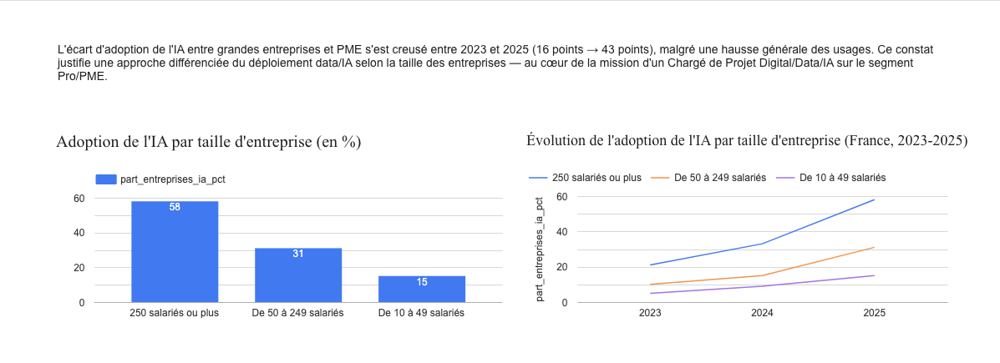

# L'IA en entreprise, mais pas pour tout le monde

## En bref
Je voulais vérifier si les PME rattrapent leur retard sur l'IA, ou si l'écart se creuse. Les chiffres officiels de l'Insee répondent clairement — et pas dans le sens où je m'y attendais.



*[Voir le dashboard interactif](https://datastudio.google.com/reporting/80b607fa-71f1-461c-b5ae-30e91c213f86)*

En 2025, 58 % des entreprises de 250 salariés et plus utilisent une techno d'IA, contre 15 % pour les 10-49 salariés.

| | 2023 | 2024 | 2025 | Ecart 2025-2023 |
|---|---|---|---|---|
| 10 à 49 salariés | 5 % | 9 % | 15 % |10% |
| 50 à 249 salariés | 10 % | 15 % | 31 % |21% |
| 250 salariés ou plus | 21 % | 33 % | 58 % |37% |
| **Écart (250+ vs 10-49)** | 16 pts | 24 pts | **43 pts** | **26 pts** |

L'écart a presque triplé en deux ans. Tout le monde adopte l'IA plus vite qu'avant, mais les grandes entreprises accélèrent encore plus — l'écart se creuse au lieu de se refermer.

## D'où viennent les chiffres
[Insee Première n° 2120](https://www.insee.fr/fr/statistiques/9025878), enquête TIC entreprises 2023-2025.

## Reproduire
```bash
pip install -r requirements.txt
python3 scripts/clean_data.py
```
Le script prend le fichier Excel brut de l'Insee, en extrait les chiffres utiles et vérifie qu'il obtient bien le bon nombre de lignes avant de créer le fichier propre (`data/insee_ia_pour_powerbi.csv`), prêt pour un outil de dataviz.

## Ce que ces chiffres ne disent pas
Ils mesurent "au moins une techno d'IA utilisée", pas l'intensité d'usage. L'enquête exclut aussi les entreprises de moins de 10 salariés. Et on ne sait pas si c'est vraiment la taille de l'entreprise qui explique l'écart, ou d'autres facteurs liés (secteur, maturité numérique déjà présente avant).

Alvin Kouadio
